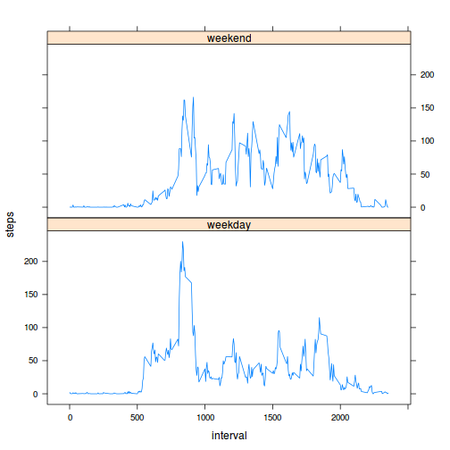

# This is Reproducible Research Assignment 1
# =============================================
by S. Deniau

##What is mean total number of steps taken per day? 

After loading the data, we plot a histogram of the total number of steps taken each day and calculate the mean and median total number of steps taken per day


```r
data<-read.csv("activity.csv")
meanperday<-aggregate(steps~date, data=data, FUN=sum, na.ram=TRUE)
hist(meanperday$steps)
```

 

```r
mean(meanperday$steps)
```

```
## [1] 10767.19
```

```r
median(meanperday$steps)
```

```
## [1] 10766
```

##What is the average daily activity pattern?

We make a time series plot of the 5-minute interval and the average number of steps taken, averaged across all days and calculate which interval contains the maximum number of steps


```r
meanperinterval<-aggregate(steps~interval, data=data, FUN=mean, na.ram=TRUE)
plot(meanperinterval,type="l")
```

 

```r
subset(meanperinterval,steps==max(steps))$interval
```

```
## [1] 835
```

```r
sum(is.na(data$steps))
```

```
## [1] 2304
```

##Imputing missing values

We replace missing values by the mean of the for that 5-minutes interval. We then plot histogram and calculate the new mean and median values. Imputing missing values made median and mean get the same value.

```r
int<-unique(data$interval)
data2<-data
for (x in int){data2[data2$interval==x&is.na(data2$steps),1]= meanperinterval[meanperinterval$int==x,2] }
meanperday2<-aggregate(steps~date, data=data2, FUN=sum, na.ram=TRUE)
hist(meanperday2$steps)
```

 

```r
mean(meanperday2$steps)
```

```
## [1] 10767.19
```

```r
median(meanperday2$steps)
```

```
## [1] 10767.19
```

##Are there differences in activity patterns between weekdays and weekends?

We make a panel plot containing a time series plot of the 5-minute interval and the average number of steps taken, averaged across all weekday days or weekend days.

```r
day<-weekdays(as.Date(data$date))
weekend<-c("samedi","dimanche")
day[day%in%weekend]<-"weekend"
day[!day%in%weekend&!(day=="weekend")]<-"weekday"
dataperdaytype<-cbind(data2,day)
meanperdaytype<-aggregate(steps~interval+day, data=dataperdaytype, FUN=mean, na.ram=TRUE)
library(lattice)
xyplot(steps ~ interval | day, data=meanperdaytype, type='l', layout=c(1,2))
```

 
